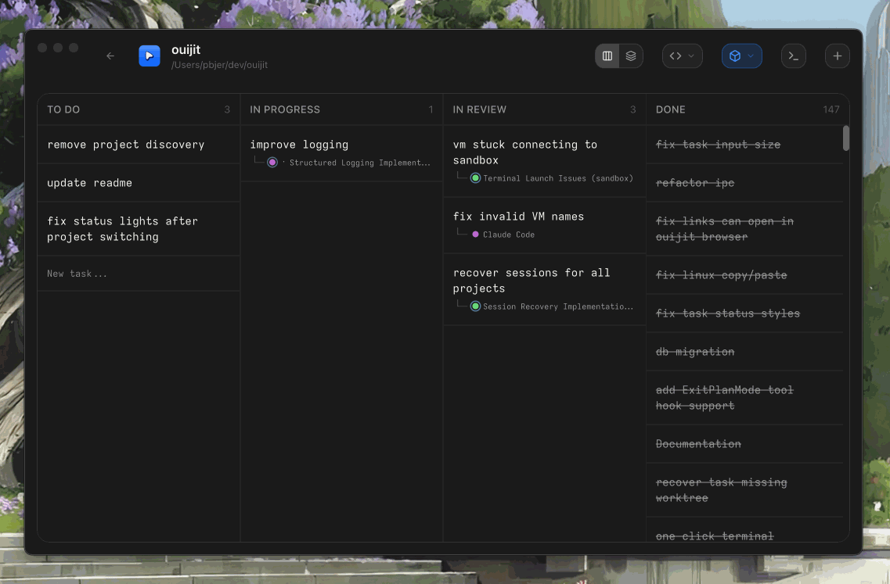

<div align=center></div>

  <p align="center">
    Kanban terminal manager for CLI agent workflows with automatic git worktree isolation and VM sandbox support included.
    <br />
    <span align=center>
    <a href="https://github.com/ouijit/ouijit/releases/latest/download/ouijit-darwin-arm64.zip">macOS (Apple Silicon)</a>
    ·
    <a href="https://github.com/ouijit/ouijit/releases/latest/download/ouijit-darwin-x64.zip">macOS (Intel)</a>
    ·
    <a href="https://github.com/ouijit/ouijit/releases/latest/download/ouijit-linux-x64.zip">Linux</a>
    </span>
  </p>



## Setup

Requires Node.js 20+, git, and C/C++ build tools for native modules (better-sqlite3, node-pty, koffi):

- **macOS:** `xcode-select --install`
- **Linux:** `sudo apt install build-essential python3` (Debian/Ubuntu)

```bash
git clone https://github.com/pbjer/ouijit.git
cd ouijit
npm install
npm start
```
